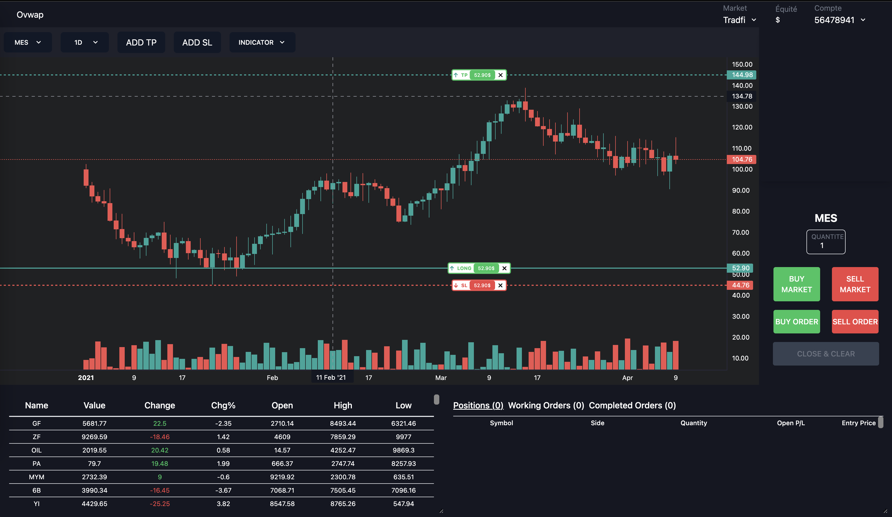
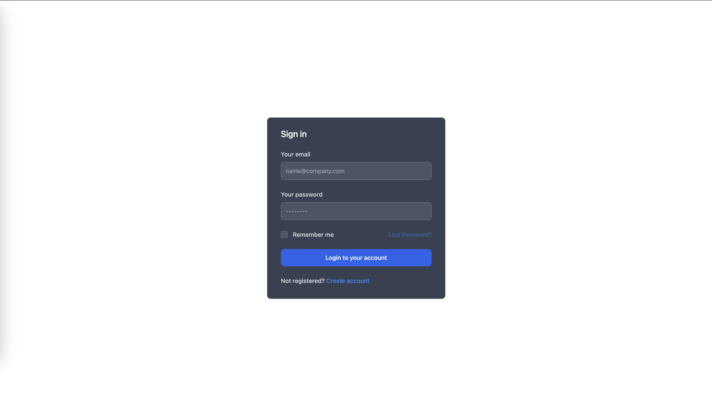
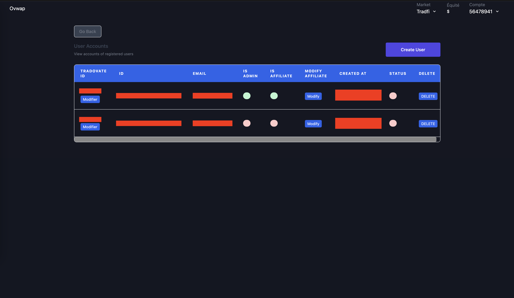

As the developer of Ovwap, my role was to design a web application offering a robust alternative for traders looking to actively engage in the CME financial markets.
The platform features an innovative program that allows traders to access funding for their transactions, establishing a mutually beneficial relationship. In addition to financial opportunities, our platform provides exclusive resources, advanced analytical tools, and a dynamic community to foster ongoing skill development.

Built with React, Express, MongoDB, and hosted on OVH, this platform offers a secure and dynamic trading simulation experience.

The secure login page, enriched with input fields and animations, communicates seamlessly with the backend and a password-protected database. In contrast to traditional setups, user accounts are not self-registered; instead, administrators have the exclusive capability to create accounts.

For this purpose, I implemented an administrator page, allowing the creation, suspension, or updating of any account on the platform. Accessible only to designated administrators, this page provides direct management access to the underlying database.

The main page of the application is a hub of various elements, featuring the integration of the TradingView library with custom modifications.
Noteworthy adaptations include direct drag-and-drop functionality onto the chart and buttons. These enhancements were achieved through direct modifications to the library.
Additionally, a trading execution panel enables users to place different orders, executed on Tradovate, our broker.

Furthermore, the platform includes customizable components, allowing users to freely move and resize them according to their preferences. This flexibility enhances the user experience, providing a tailored approach to trading simulation.

Source on demand: [Ovwap on GitHub](https://github.com/HugoCaulfield), contact me
