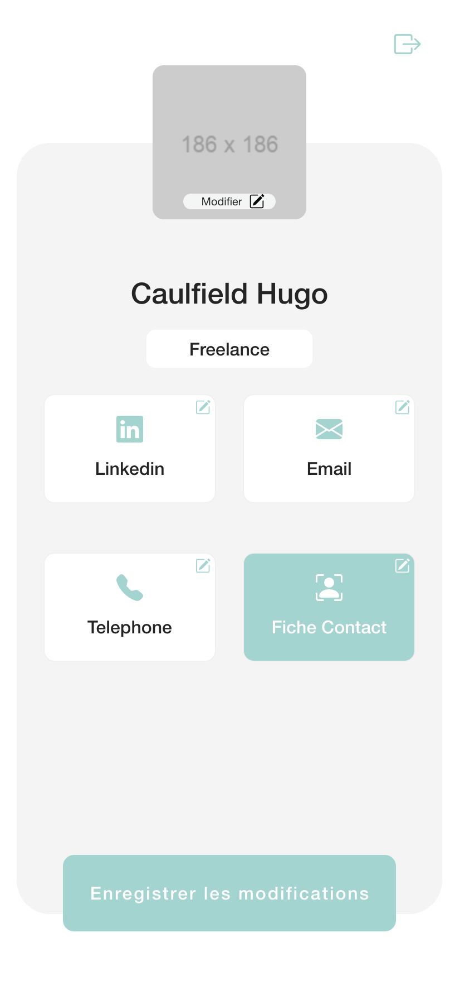

As the developer of yumeet.fr, I crafted a unique experience for entrepreneurs, focusing on simplicity and efficiency.

Built with technologies such as Next.js, Airtable, Node.js, and deployed on the OVH platform with an added layer of SSL security, yumeet.fr provides an elegant mobile solution for professional networking.

The secure login page, developed with subtle animations, ensures a secure interaction with the Airtable database.

Registration, a crucial step, guides users through an animated sequence before leading them to the main page.

On this central page, I emphasized customization. Each element, from changing the profile picture to managing the contact card, is intuitively editable to meet the unique needs of each user.

A handy feature even allows the direct import of contacts to iOS and Android devices, simplifying the process of updating professional networks.

In addition to its utility for logged-in members, yumeet.fr also serves as a compelling showcase for non-connected visitors, subtly presenting the features that await them after registration.

The visual design, derived from meticulously integrated mockups, is characterized by its minimalism and elegance. Subtle animations add a touch of friendliness to the user experience without sacrificing the simplicity that defines the site's strength.

In summary, yumeet.fr is more than just a social network for entrepreneurs; it's a creation I carefully shaped to deliver a smooth, practical, and personalized experience in the demanding realm of professional networking.

Source on demand: <a href="https://github.com/HugoCaulfield"><i class="large github icon "></i>Yumeet</a>, contact me
